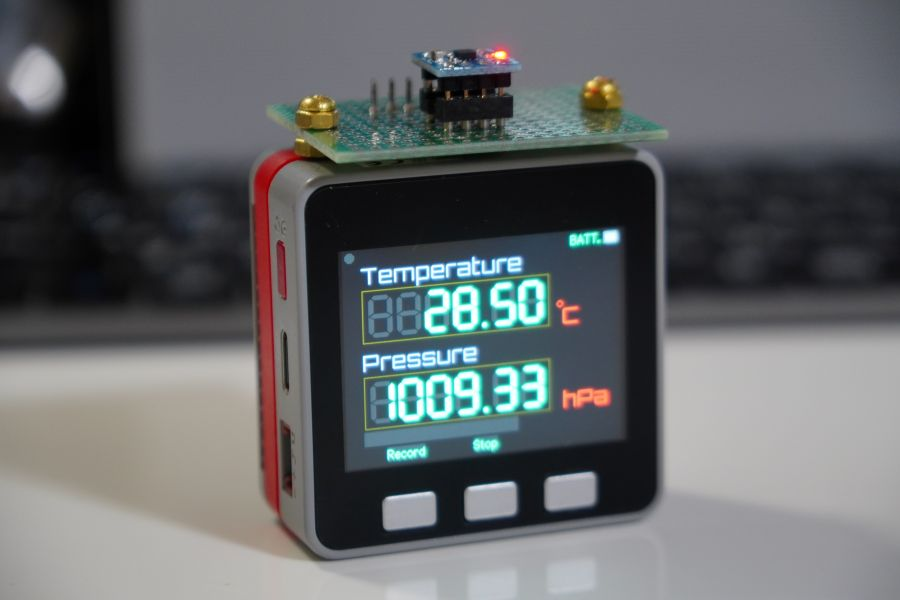

### LPS25H temperature and pressure sensor connected to M5Stack

An M5Stack communuicates with an LPS25H temperature and pressure sensor through I2C and record the data into a microSD card every 0.5 seconds.

